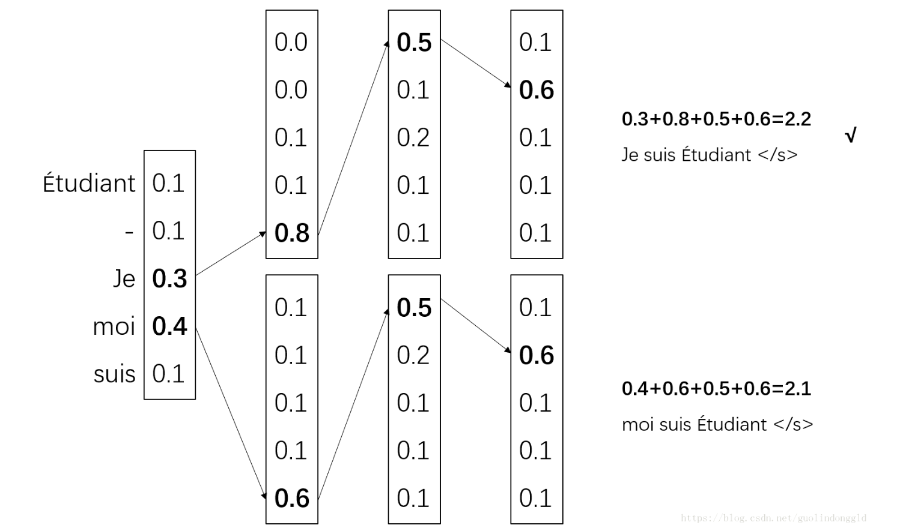

# Beam Search 束搜索



这里是一个 `beam_size=2` 的Beam Search示意图，每个节点都会扩展5个下级节点，在 Beam Search 每次都会从所有扩展节点里面挑选出2个累计启发值最大的节点，直到达到结束标准。

## 理念

Beam Search 是对 Greedy Search（贪心搜索）的一个改进算法，能够扩展贪心搜索的搜索空间。

以语言生成为例，指定 `beam_size=k` ，Beam Search 的算法描述为：

1. 将开始节点 $x_0$ 通过模型预测生成 $m$ 个节点 $\hat{x}_1 :[m, ]$
2. 从 $\hat{x}_1$ 中挑选出概率最大的 $k$ 个节点 $x_1:[k, ]$
3. 将 $x_1$ 每个节点通过模型预测生成 $k\times m$ 个节点 $\hat{x}_2:[k \times m,]$
4. 从 $\hat{x}_2$ 中挑选出概率最大的 $k$ 个节点 $x_2:[k, ]$
5. ......
6. 直到 $k$ 个语句全部遇到 `<eos>` 或者超过最大搜索深度。

## 示例

```python
from math import log
from numpy import array
from numpy import argmax

# beam search
def beam_search_decoder(data, k):
    sequences = [[list(), 1.0]]
    for row in data:
        all_candidates = list()
        for i in range(len(sequences)):
            seq, score = sequences[i]
            for j in range(len(row)):
                candidate = [seq + [j], score * -log(row[j])]
                all_candidates.append(candidate)
        # 所有候选根据分值排序
        ordered = sorted(all_candidates, key=lambda tup:tup[1])
        # 选择前k个
        sequences = ordered[:k]
    return sequences

# 定义一个句子，长度为10，词典大小为5
data = [[0.1, 0.2, 0.3, 0.4, 0.5],
        [0.5, 0.4, 0.3, 0.2, 0.1],
        [0.1, 0.2, 0.3, 0.4, 0.5],
        [0.5, 0.4, 0.3, 0.2, 0.1],
        [0.1, 0.2, 0.3, 0.4, 0.5],
        [0.5, 0.4, 0.3, 0.2, 0.1],
        [0.1, 0.2, 0.3, 0.4, 0.5],
        [0.5, 0.4, 0.3, 0.2, 0.1],
        [0.1, 0.2, 0.3, 0.4, 0.5],
        [0.5, 0.4, 0.3, 0.2, 0.1]]
data = array(data)
# 解码
result = beam_search_decoder(data, 3)
# print result
for seq in result:
    print(seq)
```

这是一个 Beam Search 例子，假设我们已经计算出语句每个位置单词的启发值（这里例子和真实的 NLP情况有所区别，真实的 NLP 里词是一个个产生的，不能一次产生全部）。这样可以得到 Beam Search 搜索结果，输出3个期望最高的语句。


# 在 NLP 中使用 Beam Search 搜索生成语句的方法

```python
 def beam_search(self, image_path, beam_size=3):
        assert callable(self.image_transform)
        # Load the image
        image = Image.open(image_path).convert('RGB')
        image = self.image_transform(image.resize(self.image_shape))
        image = image.unsqueeze(0)
        self.model.eval()
        with torch.no_grad():
            image = image.to(self.device)
            k = beam_size
            topk_prev_tokens = torch.LongTensor([[self.field.vocab.stoi[self.field.init_token]]] * k).to(self.device)
            topk_sequences = topk_prev_tokens
            topk_logps = torch.zeros(k, 1).to(self.device)
            complete_sequences, complete_sequence_logps = [], []
            image_features = self.model.encode(image)
            image_features = image_features.view(1, -1, self.model.hidden_size)
            image_features = image_features.expand(k, -1, -1)
            h_state, c_state = self.model.lstm_decoder.init_h0(image_features[:, 0, :]), self.model.lstm_decoder.init_c0(image_features[:, 0, :])
            h_state, c_state = h_state.unsqueeze(0).repeat(self.model.lstm_decoder.layer*2, 1, 1), c_state.unsqueeze(0).repeat(self.model.lstm_decoder.layer*2, 1, 1) 
            # Decoding
            step = 1
            while True:
                if len(h_state.shape) < 3:
                    h_state, c_state = h_state.unsqueeze(0), c_state.unsqueeze(0)
                logit, h_state, c_state = self.model.lstm_decoder.decode(topk_prev_tokens.squeeze(1), h_state, c_state, image_features[:, step-1, :])
                logp = F.log_softmax(logit, dim=1)
                logp = topk_logps.expand_as(logp) + logp
                if step == 1:
                    topk_logps, topk_tokens = logp[0].topk(k, 0, True, True)
                else:
                    topk_logps, topk_tokens = logp.view(-1).topk(k, 0, True, True)
                prev_tokens = topk_tokens // self.model.lstm_decoder.vocab_size
                next_tokens = topk_tokens % self.model.lstm_decoder.vocab_size
                topk_sequences = torch.cat((topk_sequences[prev_tokens], next_tokens.unsqueeze(1)), dim=1)
                incomplete_indices = [indice for indice, next_token in enumerate(next_tokens) if next_token != self.field.vocab.stoi[self.field.eos_token]]
                complete_indices = list(set(range(len(next_tokens))) - set(incomplete_indices))
                if len(complete_indices) > 0:
                    complete_sequences.extend(topk_sequences[complete_indices].tolist())
                    complete_sequence_logps.extend(topk_logps[complete_indices])
                k -= len(complete_indices) 
                if k == 0:
                    break
                topk_sequences = topk_sequences[incomplete_indices]
                h_state = h_state[:, prev_tokens[incomplete_indices], :]
                c_state = c_state[:, prev_tokens[incomplete_indices], :]
                image_features = image_features[prev_tokens[incomplete_indices]]
                topk_logps = topk_logps[incomplete_indices].unsqueeze(1)
                topk_prev_tokens = next_tokens[incomplete_indices].unsqueeze(1)
                if step >= self.max_len:
                    if len(complete_indices) == 0:
                        complete_sequences.extend(topk_sequences.tolist())
                        complete_sequence_logps.extend(topk_logps[incomplete_indices])
                    break
                step += 1       
            i_s = torch.topk(torch.Tensor(complete_sequence_logps), 1, sorted=True).indices
            captions, lenofcaptions = [], []
            for i in i_s:
                sequence = complete_sequences[i]
                captions.append(' '.join([self.field.vocab.itos[token] for token in sequence if token not in 
                                   {self.field.vocab.stoi[self.field.init_token],
                                    self.field.vocab.stoi[self.field.eos_token],
                                    self.field.vocab.stoi[self.field.pad_token]}]))      
                lenofcaptions.append(len(sequence))
            caption = captions[lenofcaptions.index(max(lenofcaptions))]
            cq = self.model.get_context_query(image)
        return caption, complete_sequence_logps, cq
```

# beam search 的一些变种

- Length-normalized beam search: This approach aims to mitigate the bias towards shorter sequences that is often seen with standard beam search. Instead of selecting the candidate sequence with the highest score, the length-normalized beam search divides the score by the length of the sequence to give preference to longer sequences.

- Diverse beam search: This method aims to generate a more diverse set of output sequences by encouraging the model to explore different paths in the search space. This is typically achieved by adding a diversity penalty term to the objective function that encourages the selection of candidate sequences that are dissimilar to previously selected ones.

- Ensemble beam search: This approach involves running beam search on multiple models or model checkpoints in parallel and combining the results to generate the final output. This can help to reduce the risk of the search getting stuck in a suboptimal solution and increase the diversity of the output.

- Sampling-based beam search: This method involves sampling from the distribution of possible outputs at each step instead of selecting the candidate with the highest score. This can help to explore a wider range of possible outputs and reduce the risk of getting stuck in a local optimum.

- Constrained beam search: This approach involves incorporating constraints into the search process to ensure that the generated output satisfies certain conditions. This can be useful in scenarios where the output needs to adhere to certain rules or constraints, such as grammaticality or semantic coherence.
