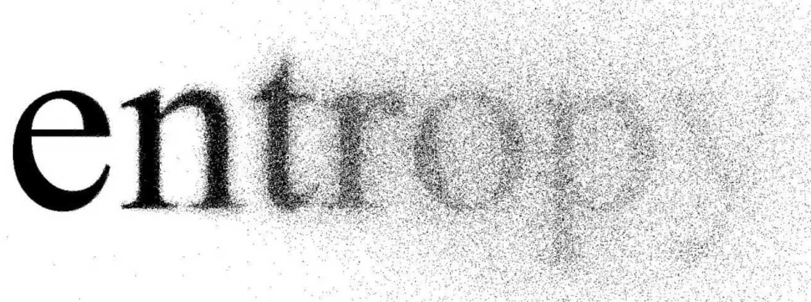

# Cross Entropy 交叉熵



## 信息熵

在信息世界中我们所有的信息都可以抽象为“情况”，用二进制 `bit` 来表达，正因为每个 `bit` 都有 `0` `1` 两种“情况”，所以 $n$ 个 `bit` 可以编码 $2^n$ 种“情况”。但是现实中，假如我们要从英语单词中随机中取出一个字符， $x=26 \neq2^n$ 因此我们需要取对数来将“情况”数表述成比特量：
$$
\log_2(x)
$$
这样我们对任何多种“情况”都可以用比特量来表示它了。如今我们还面临一个问题，就是多数情况下各种“情况”并不是均匀分布的，这会造成信息熵差异，例如英语单词虽然都是由26个字母组成，但是每种字母出现的频率也有很大区别，像 `a` `e` `t` 这样的字母非常常见，而 `z` `v` 这样的字母则很少出现，为了能够精准地表示每个状态频率对信息量的影响，我们考虑将每个字母的信息量加权求和，来得到总体的信息量：
$$
\sum_i^n P(x_i)\log_2(x_i)
$$
这个公式已经初步地可以描述“情况”的分布了，但还不够，因为我们需要得知 $x_i$ 的值，然而在一个“情况”的分布中我们只有 $P(x_i)$ ，能不能用 $P(x_i)$ 间接表示 $x_i$ ？答案是肯定的，根据“概率的倒数等于等概率情况的个数”的思想，我们可以用 $P(x_i)^{-1}$ 来代替 $x_i$ （这个有点抽象，我们可以用哈夫曼树编码来类比一下，凡是出现概率大的字母编码是短的，出现概率小的字母编码是较长的，其中出现概率就是 $P(x_i)$ 编码长度是 $x_i$ ）：
$$
\sum_i^nP(x_i)\log_2(\dfrac{1}{P(x_i)})
$$
变换一下即可得到信息熵公式：
$$
\text{Entropy}(P)=-\sum P(x_i)\log_2P(x_i)
$$

## 交叉熵

现在我们想办法能不能把这个公式拓展一下，用来比较两个不同分布 $P$ 和 $Q$ 的差异度，这里我们重新留意到 $\log$ 后面的 $P(x_i)$ ，只要我们换个思路，将“情况“分布换成 $Q(x_i)$ 这样不就代表了用 $P$ 分布来编码 $Q$ 分布信息的熵了吗，当 $P=Q$ 时，两者的信息熵也一致。因此我们得到了交叉熵公式：
$$
\text{CrossEntropy}(P, Q)=-\sum_i^nP(x_i)\log_2Q(x_i)
$$

特别地，当 $x_i \in 0,1$ 只有两类时，令 $P(1)=y$ 、$Q(1)=x$ 化简得二分类交叉熵公式：
$$
\text{BCE}(P,Q) = -(1-y)\log_2(1-x) -y\log_2(x)
$$

## KL 散度

得到交叉熵后我们才完成了一半，因为很显然当分布 $Q=P$ 时：
$$
\text{CrossEntropy}(P,Q)=\text{Entropy}(P)\neq0
$$
那我要衡量 $P$ 和 $Q$ 的差距的话，就要在这个基础上减去 $\text{Entropy}(P)$ ，这就是著名的 KL 散度公式：
$$
\begin{align}
KL(P||Q)&=\text{CrossEntropy}(P, Q)-\text{Entropy(P)}\\
&=-\sum_i^nP(x_i)\log_2Q(x_i) - (-\sum_i^nP(x_i)\log_2P(x_i))\\
&=\sum_i^nP(x_i)\log_2P(x_i)-\sum_i^nP(x_i)\log_2Q(x_i)\\
&=\sum_i^nP(x_i)\log_2\dfrac{P(x_i)}{Q(x_i)}

\end{align}
$$
当我 $P=Q$ 两个分布一样时， $\log_21=0$ 也即两个分布的误差为 0 。

## 为什么用交叉熵

 在深度学习中我们经常在分类任务遇到：

```python
criterion = torch.nn.CrossEntropyLoss()
criterion = torch.nn.BCELoss()
......
loss = criterion(x, y)
```

即使用交叉熵来计算损失，这是怎么回事呢？前面不是应该要采用 KL 散度才能表示两个分布的误差吗？这一点非常简单，因为梯度下降优化的是两个分布之间的误差，而一个分布的熵在训练优化时相当于常数，因此 **KL 散度和交叉熵作为损失函数对于模型参数更新来说是等价的**。


