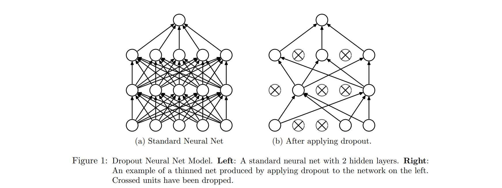
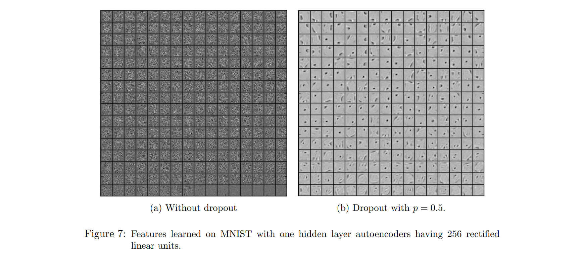

# Dropout



## 防止过拟合

训练神经网络时有一种直观的理念：使用不同的神经网络来训练，最后通过投票得出结果，这样可以防止某一个模型出现过拟合的影响，这种方法叫 **Ensemble Learning** 。但是训练多个网络花费的时间代价和空间代价是很高的，因此另一种解决的思路是在一个完整的神经网络里面通过某种方法划分出各种子网，对子网进行训练，完成后再使用子网投票得到最终输出。

完全划分为互补相关的子网显然与第一种方法没什么不同，因此采用随机划分的方式更加高效、且能够在最终训练完成的统一模型上存在各个子网的交流，这就是 Dropout 的基本理念，使用一个参数 $p$ 让神经元以概率 $p$ 失活（即输出 0 ），这样每次即使是相同的数据，神经网络内部的神经元都是不同的激活状态，相当于每次梯度反向传递时都是对内部一个更小的网络更新参数。对每个更小的网络而言，虽然它也有可能陷入过拟合，但从概率上来说每种过拟合状态都是独特的，当网络里所有子网的过拟合状态叠加时，这些过于独特的过拟合特征反而会相互抵消，只有共存的、真正有用的特征会达成共识而被保留：



## 鲁棒性、正则化

在神经网络中可能还会出现过于依赖某一特征或者某一类特征的情况，会对模型的泛化能力有影响，因此在训练时我们希望在一些时刻可以让网络破坏这种依赖性，强迫它去寻找更多的信息。使用 Dropout 可以让某些神经元失活（有可能是那些被深度依赖的神经元），这时模型再更新的梯度信息就来自其他特征，从而增强模型鲁棒性。

## 进化

使用 Dropout 产生的每个子网都是不同的，提取和关注的特征信息也不一样，在训练完成后模型不再需要 Dropout 导致的结果就是不同子网相互融合，可能会进化出更多的特征变种（这与 Ensemble 的 “投票”有所区别），通过进化可以让模型更具适应力。P.S. 为什么是进化而不是退化，其实两者都会有，但是通常来说两种有用特征的结合比较大概率会趋向于“没影响”和“有效果”，小概率造成“负效果”（玄学）。

## 代码

```python
# 作者：Microstrong,  "https://zhuanlan.zhihu.com/p/38200980"
# coding:utf-8
import numpy as np

# dropout函数的实现
def dropout(x, level):
    if level < 0. or level >= 1: #level是概率值，必须在0~1之间
        raise ValueError('Dropout level must be in interval [0, 1[.')
    retain_prob = 1. - level

    # 我们通过binomial函数，生成与x一样的维数向量。binomial函数就像抛硬币一样，我们可以把每个神经元当做抛硬币一样
    # 硬币 正面的概率为p，n表示每个神经元试验的次数
    # 因为我们每个神经元只需要抛一次就可以了所以n=1，size参数是我们有多少个硬币。
    random_tensor = np.random.binomial(n=1, p=retain_prob, size=x.shape) #即将生成一个0、1分布的向量，0表示这个神经元被屏蔽，不工作了，也就是dropout了
    print(random_tensor)

    x *= random_tensor
    print(x)
    x /= retain_prob

    return x

#对dropout的测试，大家可以跑一下上面的函数，了解一个输入x向量，经过dropout的结果  
x=np.asarray([1,2,3,4,5,6,7,8,9,10],dtype=np.float32)
dropout(x,0.4)
```

这里是 [Microstrong](https://www.zhihu.com/people/MicrostrongAI) 写的一个例子，展示了 Dropout 的内部过程，通过随机产生一个具有一定概率的 0, 1 向量与原向量相乘，再缩放回原来的尺度，关于缩放的解释是这样的，原向量的输出预期是：

$$
(1-p)\cdot x+p\cdot 0 = (1-p)x
$$

如果不采取任何措施会导致在训练时的层输出预期变为测试时的 $1-p$ 倍，输出的分布改变了，对模型的影响会很大，于是我们考虑将 Dropout 后的结果除以 $(1-p)$ 将期望变得与原先一致。

## 参考

1.  [Microstrong](https://www.zhihu.com/people/MicrostrongAI), [深度学习中Dropout原理解析]( [Microstrong](https://www.zhihu.com/people/MicrostrongAI))
2. Srivastava, Hinton, Krizhevsky, Sutskever and Salakhutdinov, [Dropout: A Simple Way to Prevent Neural Networks from Overfitting](https://wtf-deeplearning.github.io/optimization-regularization/srivastava14a.pdf)
3. [修炼之路](https://xiulian.blog.csdn.net/), [正则化之dropout(随机失活)详细介绍](https://blog.csdn.net/sinat_29957455/article/details/81023154)

