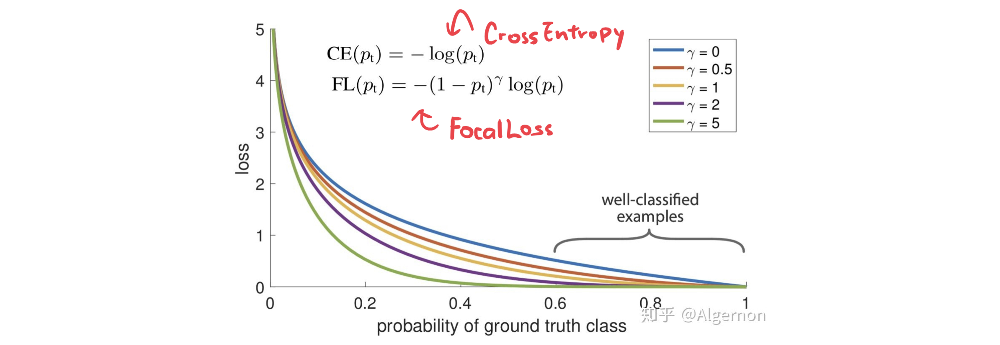

# Focal Loss



## 理念

Focal loss 可以 **平衡简单样本和困难样本（或大量样本和少量样本）的学习** 。在遇到样本不同类别之间学习难度相差很大（比如区分飞机、摩托车和自行车，飞机的特征明显与后两者更易区分，可以用混淆矩阵看出来），或者样本数量相差很多时（飞机有 1k 个样本，汽车只有 10 个，模型倾向于无脑预测飞机）时，大量简单样本产生的小 loss 可能会淹没少量困难样本的大 loss，因此我们考虑：

- 当遇到非常简单的样本、输出十分坚决时，对 loss 截断。
- 当遇到非常困难的样本、输出摸棱两可时，对 loss 保留。

这就是 Focal Loss 的基本思路，让模型更加注重困难样本所贡献的 loss ，另外 Focal loss 用于分类任务，实际上也是一种扩展的 cross entropy loss （ $\gamma=0$ 时两者一致）。

## 公式

$$
L_{fl} = 
\begin{cases}
\sigma^\gamma(-x)\log \sigma(x)\quad, y=1\\
\sigma^\gamma(x)\log \sigma(-x)\quad, y=0
\end{cases}
$$


## 代码

```python
import torch
import torch.nn as nn
import torch.nn.functional as F
from torch.autograd import Variable
 
class FocalLoss(nn.Module):
 	"""
 	Focal Loss
 	"""
    def __init__(self, class_num, alpha=None, gamma=2, size_average=True):
        super(FocalLoss, self).__init__()
        if alpha is None:
            self.alpha = Variable(torch.ones(class_num, 1))
        else:
            if isinstance(alpha, Variable):
                self.alpha = alpha
            else:
                self.alpha = Variable(alpha)
        self.gamma = gamma
        self.class_num = class_num
        self.size_average = size_average
 
    def forward(self, inputs, targets):
        N = inputs.size(0)
        C = inputs.size(1)
        P = F.softmax(inputs, dim=-1)
 
        class_mask = inputs.data.new(N, C).fill_(0)
        class_mask = Variable(class_mask)
        ids = targets.view(-1, 1)
        class_mask.scatter_(1, ids.data, 1.)
        #print(class_mask)
 
 
        if inputs.is_cuda and not self.alpha.is_cuda:
            self.alpha = self.alpha.cuda()
        alpha = self.alpha[ids.data.view(-1)]
 
        probs = (P*class_mask).sum(1).view(-1,1)
 
        log_p = probs.log()
        #print('probs size= {}'.format(probs.size()))
        #print(probs)
 
        batch_loss = -alpha*(torch.pow((1-probs), self.gamma))*log_p 
        #print('-----bacth_loss------')
        #print(batch_loss)
 
 
        if self.size_average:
            loss = batch_loss.mean()
        else:
            loss = batch_loss.sum()
        return loss
```

```python
focal_loss = FocalLoss(10)
a = torch.rand(64, 10)
b = torch.ones(10).long()
focal_loss(a, b)
```

## BCEFocalLoss

使用 BCELoss + FocalLoss 可以实现多标签分类。

$$
\begin{align}
\begin{cases}
&-\alpha&(1-pred)^\gamma &\log(pred)\quad&, \text{when } label=1\\
&-(1-\alpha)&(pred)^\gamma &\log(1-pred)\quad&, \text{when } label=0
\end{cases}
\end{align}
$$

其中 $\alpha$ 用来调节容易样本和困难样本的 $loss$  ， $\gamma$ 用来调节样本数量不均衡的 $loss$ 。

代码：

```python
class BCEFocalLoss(torch.nn.Module):
    def __init__(self, gamma=2, alpha=0.25, reduction='mean'):
        super(BCEFocalLoss, self).__init__()
        self.gamma = gamma
        self.alpha = alpha
        self.reduction = reduction
 
    def forward(self, predict, target):
        pt = predict
        loss = (-self.alpha) * (1 - pt) ** self.gamma * torch.log(pt) * target \
            - (1 - self.alpha) * (pt ** self.gamma) * torch.log(1 - pt) * (1 - target)
 
        if self.reduction == 'mean':
            loss = torch.mean(loss)
        elif self.reduction == 'sum':
            loss = torch.sum(loss)
        return loss
```

