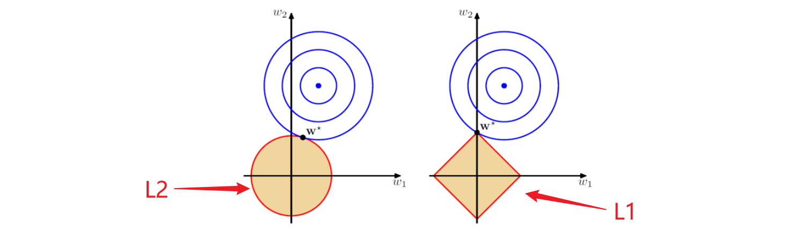

# L1 Regularization


## 拉格朗日乘数法

假设我们的模型有一堆参数 $x_0,x_1, x_2, ...,x_n$ 和对应的损失函数 $loss=f(x_0, ..., x_n)$ ，我们可以通过 $\nabla f=0$ 来计算可能的极值点，但是假如参数之间必须满足某些关系条件，例如：
$$
\begin{cases}
g_1(x_0, ... x_n)=0\\
g_2(x_0, ... x_n)=0\\
g_3(x_0, ... x_n)=0\\
\end{cases}
$$
这时直接计算 $\nabla f=0$ 就不可行了，根据高数的内容应该使用拉格朗日乘数法，令 $h(x_0, ...,x_n)=f+ \sum_{\forall m } \lambda_mg_m$ ，求：
$$
\begin{cases}
\frac{\part h}{\part x_1} = 0\\

......\\
\frac{\part h}{\part x_n} = 0\\
\frac{\part h}{\part \lambda_1} = 0\\
......\\
\frac{\part h}{\part \lambda_m} = 0
\end{cases}
$$
此时解出的 $x_1, ..., x_n$ 即为满足条件下可能的极值点。

## L1 正则化项

观察上面的 $h$ 函数，事实上它的极小值点就是 $loss$ 函数在满足条件 $g_1, g_2, ...,g_m$ 下的极小值点，即假如我们按照 $h$ 函数而非 $loss$ 函数作为损失函数，既可以修改梯度下降的最终目标位置，让它满足一定条件而非盲目地以训练集的最小损失为目标，避免过拟合情况的出现。


这里我们做一个简化，令 $h$ 函数只考虑一个条件 $g$ ，并重新命名为 $Loss$ ，此时有：
$$
Loss = f(x_0,...,x_n)+g(x_0,...,x_n)
$$
现在问题来了，对损失函数做限制的 $g$ 应该怎么设定才合适？在神经网络发展的进程中有一些没有办法完全证明但是由经验所得的结论，其中一个是“稀疏的参数会筛选出更重要的特征”，意思也很容易理解，就是神经网络中**少量的、显著的参数，更能体现数据的主要特征，同时减少过拟合出现**。根据这个思想，对模型中所有参数取绝对值再求和作为 $g$ ，就是我们的 L1 正则项：
$$
g = L1\_Penalty=\lambda\sum^n_{j=0}|x_j|
$$
其中 $\lambda$ 为系数，用于整个正则项放缩。在这个正则条件下模型会强制进行特征选择，一些不那么重要的参数都会变成 0 ，重要的参数会保留。这很像一种“惩罚”机制，强迫模型在参数之间做出选择，因此这一个正则项也被叫做 L1 Penalty 。


## 另一种解释



如图右半部分 L1 所指，我们在优化 Loss 梯度下降时：
$$
Loss=f+g=loss+\lambda\sum^m_{j=0}|x_j|=0
$$
实际上是在求 $f$ 和 $g$ 的交点，模型训练时 $f$ 的值一般是受最优解距离影响的，这里我们假设它的情况是多个同心圆（圆心位置为最优解，周围误差逐渐上升），而 L1 项由于是多个参数的绝对值相加（在二维情况下为 $g=|x|+|y|$ 是一个菱形），会有很多的“尖刺”部分，因此 $f$ 和 $g$ 的交点处非常容易出现在“尖刺”的部分（如图中的 $w^*$），此时 $w^*$ 离圆心有一定距离**避免了过拟合的产生**，同时“尖刺”部分一般是某一些参数为 0 的结果（在坐标轴上）**实现了参数的稀疏化**。

## L1 正则化


这个图里清楚地描述了经过 L1 正则化后，模型的参数变得稀疏、显著，而且由于正则项是跟在 $loss$ 函数后面的，不会影响 $loss$ 函数的正常计算：
$$
Loss = loss+L1\_Penalty
$$

## 代码

L1 正则化的代码在 `torch` 里没有集成，但它本身也很简单，只需把参数拉出来做绝对值求和再加到 `loss` 后面：

```python
lambda_ = 0.01
regularity = 0
for param in model.parameters():
    regularity += torch.sum(torch.abs(param))
loss = loss + lambda_ * regularity
```

