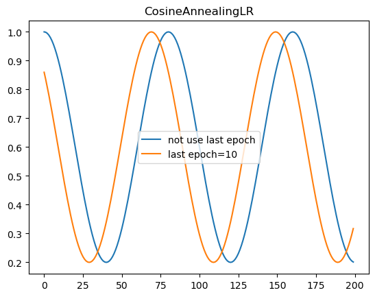
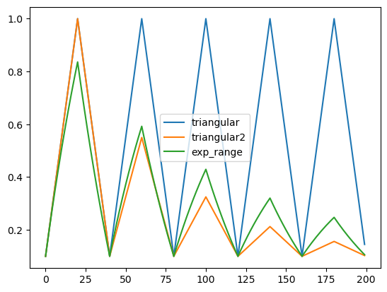
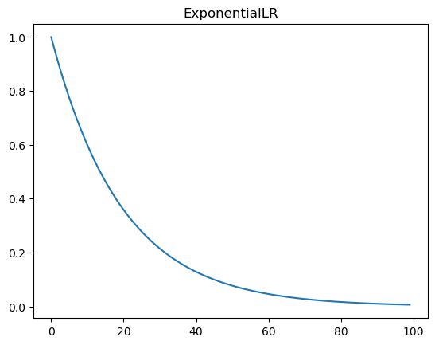
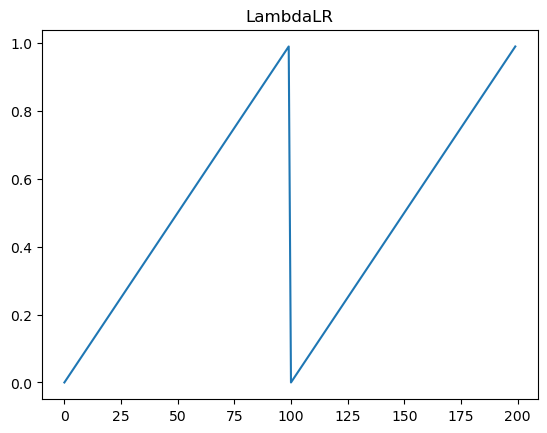
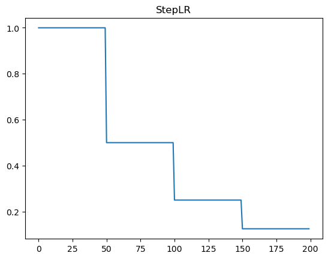

# Learning Rate Decay 学习率衰减

## 使用格式

```python
optimizer = torch.optim.SGD(model.paraters(), lr=0.1, momentum=0.9, weight_decay=1e-4)
scheduler = torch.optim.lr_scheduler.StepLR(optimizer=optimizer, step_size=100, gamma=0.5)

for epoch in range(200):
	for step, (x, y) in enumerate(train_dl):
        train_step(x, y)
    validate(valid_dl)
    scheduler.step()
    torch.save(model, "model.pth")
```

## 预先准备

导入 `torch` `torch.optim` 和 `lr_scheduler` ，函数 `get_lr_scheduler(optim, scheduler, total_step)` 可以模拟对应的 `scheduler` 在 `total_step` 步里变化的过程，返回每一步学习率的数值组成列表。

```python
import os
import torch
from torch.optim import lr_scheduler
import matplotlib.pyplot as plt


def get_lr_scheduler(optim, scheduler, total_step):
    '''
    get lr values
    '''
    lrs = []
    for step in range(total_step):
        lr_current = optim.param_groups[0]['lr']
        lrs.append(lr_current)
        if scheduler is not None:
            scheduler.step()
    return lrs
# global
model = torch.nn.Sequential(torch.nn.Conv2d(3, 4, 3))
initial_lr = 1.
total_step = 200
```


## CosineAnnealingLR

- **optimizer** (*Optimizer*) – Wrapped optimizer.
- **T_max** (*int*) – Maximum number of iterations.
- **eta_min** (*float*) – Minimum learning rate. Default: 0.
- **last_epoch** (*int*) – The index of last epoch. Default: -1.
- **verbose** (*bool*) – If `True`, prints a message to stdout for each update. Default: `False`.

```python
torch.optim.lr_scheduler.CosineAnnealingLR(
    optimizer, 
    T_max, 
    eta_min=0,
    last_epoch=-1,
    verbose=False
)
```

```python
def plot_cosine_aneal():
    plt.clf()
    optim = torch.optim.Adam([{'params': model.parameters(),
                            'initial_lr': initial_lr}], lr=initial_lr)
    # optim = torch.optim.Adam(model.parameters(), lr=initial_lr)
    scheduler = lr_scheduler.CosineAnnealingLR(
        optim, T_max=40, eta_min=0.2)
    lrs = get_lr_scheduler(optim, scheduler, total_step)
    plt.plot(lrs, label='not use last epoch')
    # pdb.set_trace()
    
    # if not re defined, the init lr will be lrs[-1]
    optim = torch.optim.Adam([{'params': model.parameters(),
                            'initial_lr': initial_lr}], lr=initial_lr)
    scheduler = lr_scheduler.CosineAnnealingLR(
        optim, T_max=40, eta_min=0.2, last_epoch=10)
    lrs = get_lr_scheduler(optim, scheduler, total_step)
    plt.plot(lrs, label='last epoch=10')

    plt.title('CosineAnnealingLR')
    plt.legend()
    plt.show()
```



## CyclicLR

- **optimizer** ([*Optimizer*](https://pytorch.org/docs/stable/optim.html#torch.optim.Optimizer)) – Wrapped optimizer.
- **base_lr** ([*float*](https://docs.python.org/3/library/functions.html#float) *or* [*list*](https://docs.python.org/3/library/stdtypes.html#list)) – Initial learning rate which is the lower boundary in the cycle for each parameter group.
- **max_lr** ([*float*](https://docs.python.org/3/library/functions.html#float) *or* [*list*](https://docs.python.org/3/library/stdtypes.html#list)) – Upper learning rate boundaries in the cycle for each parameter group. Functionally, it defines the cycle amplitude (max_lr - base_lr). The lr at any cycle is the sum of base_lr and some scaling of the amplitude; therefore max_lr may not actually be reached depending on scaling function.
- **step_size_up** ([*int*](https://docs.python.org/3/library/functions.html#int)) – Number of training iterations in the increasing half of a cycle. Default: 2000
- **step_size_down** ([*int*](https://docs.python.org/3/library/functions.html#int)) – Number of training iterations in the decreasing half of a cycle. If step_size_down is None, it is set to step_size_up. Default: None
- **mode** ([*str*](https://docs.python.org/3/library/stdtypes.html#str)) – One of {triangular, triangular2, exp_range}. Values correspond to policies detailed above. If scale_fn is not None, this argument is ignored. Default: ‘triangular’
- **gamma** ([*float*](https://docs.python.org/3/library/functions.html#float)) – Constant in ‘exp_range’ scaling function: gamma**(cycle iterations) Default: 1.0
- **scale_fn** (*function*) – Custom scaling policy defined by a single argument lambda function, where 0 <= scale_fn(x) <= 1 for all x >= 0. If specified, then ‘mode’ is ignored. Default: None
- **scale_mode** ([*str*](https://docs.python.org/3/library/stdtypes.html#str)) – {‘cycle’, ‘iterations’}. Defines whether scale_fn is evaluated on cycle number or cycle iterations (training iterations since start of cycle). Default: ‘cycle’
- **cycle_momentum** ([*bool*](https://docs.python.org/3/library/functions.html#bool)) – If `True`, momentum is cycled inversely to learning rate between ‘base_momentum’ and ‘max_momentum’. Default: True
- **base_momentum** ([*float*](https://docs.python.org/3/library/functions.html#float) *or* [*list*](https://docs.python.org/3/library/stdtypes.html#list)) – Lower momentum boundaries in the cycle for each parameter group. Note that momentum is cycled inversely to learning rate; at the peak of a cycle, momentum is ‘base_momentum’ and learning rate is ‘max_lr’. Default: 0.8
- **max_momentum** ([*float*](https://docs.python.org/3/library/functions.html#float) *or* [*list*](https://docs.python.org/3/library/stdtypes.html#list)) – Upper momentum boundaries in the cycle for each parameter group. Functionally, it defines the cycle amplitude (max_momentum - base_momentum). The momentum at any cycle is the difference of max_momentum and some scaling of the amplitude; therefore base_momentum may not actually be reached depending on scaling function. Note that momentum is cycled inversely to learning rate; at the start of a cycle, momentum is ‘max_momentum’ and learning rate is ‘base_lr’ Default: 0.9
- **last_epoch** ([*int*](https://docs.python.org/3/library/functions.html#int)) – The index of the last batch. This parameter is used when resuming a training job. Since step() should be invoked after each batch instead of after each epoch, this number represents the total number of *batches* computed, not the total number of epochs computed. When last_epoch=-1, the schedule is started from the beginning. Default: -1
- **verbose** ([*bool*](https://docs.python.org/3/library/functions.html#bool)) – If `True`, prints a message to stdout for each update. Default: `False`.

```python
torch.optim.lr_scheduler.CyclicLR(
    optimizer, 
    base_lr, 
    max_lr, 
    step_size_up=2000, 
    step_size_down=None, 
    mode='triangular', 
    gamma=1.0, 
    scale_fn=None, 
    scale_mode='cycle', 
    cycle_momentum=True, 
    base_momentum=0.8, 
    max_momentum=0.9, 
    last_epoch=- 1, 
    verbose=False
)
```

```python
def plot_cyclic():
    plt.clf()
    optim = torch.optim.Adam(model.parameters(), lr=initial_lr)
    scheduler = lr_scheduler.CyclicLR(
        optim, base_lr=0.1, max_lr=1., step_size_up=20, 
        mode='triangular', cycle_momentum=False)
    lrs = get_lr_scheduler(optim, scheduler, total_step)
    plt.plot(lrs, label='triangular')

    scheduler = lr_scheduler.CyclicLR(
        optim, base_lr=0.1, max_lr=1., step_size_up=20, 
        mode='triangular2', cycle_momentum=False)
    lrs = get_lr_scheduler(optim, scheduler, total_step)
    plt.plot(lrs, label='triangular2')

    scheduler = lr_scheduler.CyclicLR(
        optim, base_lr=0.1, max_lr=1., step_size_up=20, gamma=0.99,
        mode='exp_range', cycle_momentum=False)
    lrs = get_lr_scheduler(optim, scheduler, total_step)
    plt.plot(lrs, label='exp_range')
    plt.legend()
    plt.show()
```



## ExponentialLR

- **optimizer** ([*Optimizer*](https://pytorch.org/docs/stable/optim.html#torch.optim.Optimizer)) – Wrapped optimizer.
- **gamma** ([*float*](https://docs.python.org/3/library/functions.html#float)) – Multiplicative factor of learning rate decay.
- **last_epoch** ([*int*](https://docs.python.org/3/library/functions.html#int)) – The index of last epoch. Default: -1.
- **verbose** ([*bool*](https://docs.python.org/3/library/functions.html#bool)) – If `True`, prints a message to stdout for each update. Default: `False`.

```python
torch.optim.lr_scheduler.ExponentialLR(
    optimizer, 
    gamma, 
    last_epoch=-1, 
    verbose=False
)
```

```python
def plot_exponential():
    plt.clf()
    optim = torch.optim.Adam(model.parameters(), lr=initial_lr)
    scheduler = lr_scheduler.ExponentialLR(
        optim, gamma=0.95)
    lrs = get_lr_scheduler(optim, scheduler, 100)
    plt.plot(lrs)

    plt.title('ExponentialLR')
    plt.show()
```



## LambdaLR

- **optimizer** ([*Optimizer*](https://pytorch.org/docs/stable/optim.html#torch.optim.Optimizer)) – Wrapped optimizer.
- **lr_lambda** (*function* *or* [*list*](https://docs.python.org/3/library/stdtypes.html#list)) – A function which computes a multiplicative factor given an integer parameter epoch, or a list of such functions, one for each group in optimizer.param_groups.
- **last_epoch** ([*int*](https://docs.python.org/3/library/functions.html#int)) – The index of last epoch. Default: -1.
- **verbose** ([*bool*](https://docs.python.org/3/library/functions.html#bool)) – If `True`, prints a message to stdout for each update. Default: `False`.

```python
torch.optim.lr_scheduler.LambdaLR(
    optimizer, 
    lr_lambda, 
    last_epoch=- 1, 
    verbose=False
)
```

```python
def plot_lambdalr():
    plt.clf()
    optim = torch.optim.Adam(model.parameters(), lr=initial_lr)
    scheduler = lr_scheduler.LambdaLR(
        optim, lr_lambda=lambda step: step%100/100.)
    lrs = get_lr_scheduler(optim, scheduler, total_step)
    plt.plot(lrs)
    plt.title('LambdaLR')
    plt.show()
```



## StepLR

- **optimizer** ([*Optimizer*](https://pytorch.org/docs/stable/optim.html#torch.optim.Optimizer)) – Wrapped optimizer.
- **step_size** ([*int*](https://docs.python.org/3/library/functions.html#int)) – Period of learning rate decay.
- **gamma** ([*float*](https://docs.python.org/3/library/functions.html#float)) – Multiplicative factor of learning rate decay. Default: 0.1.
- **last_epoch** ([*int*](https://docs.python.org/3/library/functions.html#int)) – The index of last epoch. Default: -1.
- **verbose** ([*bool*](https://docs.python.org/3/library/functions.html#bool)) – If `True`, prints a message to stdout for each update. Default: `False`.

```python
torch.optim.lr_scheduler.StepLR(
    optimizer, 
    step_size,
    gamma=0.1, 
    last_epoch=-1,
    verbose=False
)
```

```python
def plot_steplr():
    plt.clf()
    optim = torch.optim.Adam(model.parameters(), lr=initial_lr)
    scheduler = lr_scheduler.StepLR(
        optim, step_size=50, gamma=0.5)
    lrs = get_lr_scheduler(optim, scheduler, total_step)
    plt.plot(lrs)

    plt.title('StepLR')
    plt.show()
```



## 参考文献

[Adam与LR衰减是否可以同时使用](https://blog.csdn.net/qq_32172681/article/details/102568789)

[lr scheduler介绍和可视化](https://zhuanlan.zhihu.com/p/611364321)

