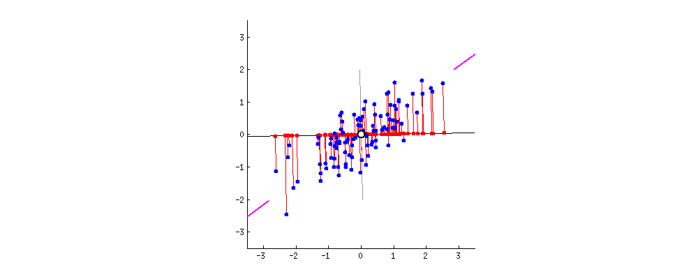

# PCA Decomposition



## 算法

1. 去除平均值 。
2. 计算协方差矩阵 。
3. 计算协方差矩阵的特征值和特征向量 。
4. 将特征值排序 保留前N个最大的特征值对应的特征向量 。
5. 将原始特征转换到上面得到的N个特征向量构建的新空间中（最后两步，实现了特征压缩）。

## 解释

1. **为什么样本在“协方差矩阵C的最大K个特征值所对应的特征向量”上的投影就是k维理想特征**

   最大方差理论:方差越大，信息量就越大。协方差矩阵的每一个特征向量就是一个投影面，每一个特征向量所对应的特征值就是原始特征投影到这个投影面之后的方差。由于投影过去之后，我们要尽可能保证信息不丢失，所以要选择具有较大方差的投影面对原始特征进行投影，也就是选择具有较大特征值的特征向量。然后将原始特征投影在这些特征向量上，投影后的值就是新的特征值。每一个投影面生成一个新的特征，k个投影面就生成k个新特征。

2. **优点**

   - 以方差衡量信息的无监督学习，不受样本标签限制。
   - 由于协方差矩阵对称，因此k个特征向量之间两两正交，也就是各主成分之间正交，正交就肯定线性不相关，可消除原始数据成分间的相互影响。
   - 可减少指标选择的工作量。
   - 用少数指标代替多数指标，利用PCA降维是最常用的算法。
   - 计算方法简单，易于在计算机上实现。

3. **缺点**

   - 主成分解释其含义往往具有一定的模糊性，不如原始样本完整。
   - 贡献率小的主成分往往可能含有对样本差异的重要信息，也就是可能对于区分样本的类别（标签）更有用。
   - 特征值矩阵的正交向量空间是否唯一有待讨论。
   - 无监督学习。

## 代码

```python
from sklearn.decomposition import PCA
import numpy as np


class PCAModule(nn.Module):
    def __init__(self, all_sample, hidden_size=32):
        nn.Module.__init__(self)
        self.hidden_size = hidden_size
        self.pca = PCA(n_components=hidden_size)
        self.fit(all_sample)

    def fit(self, all_sample):
        print("PCA Fitting ... ")
        self.pca.fit(all_sample)
        print("PCA Fitting Done")
        
    def transform(self, sample):
        return self.pca.transform(sample)
```

```python
all_sample = np.randn(1000, 256) 				# [1000, 256]
pca = PCAModule(all_sample, hidden_size=32)
decomposed_sample = pca.transform(all_sample)   # [1000, 32]
```

## 参考

1. [论智](https://www.zhihu.com/org/lun-zhi-40), [如何通俗易懂地讲解什么是 PCA（主成分分析）？](https://www.zhihu.com/question/41120789)
2. [lanyuelvyun](https://blog.csdn.net/lanyuelvyun), [PCA：详细解释主成分分析](https://blog.csdn.net/lanyuelvyun/article/details/82384179)
3. [当代女大学生](https://blog.csdn.net/qq_36895331), [用sklearn进行PCA（主成分分析）](https://blog.csdn.net/qq_36895331/article/details/117221237)

