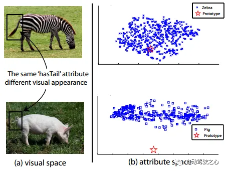
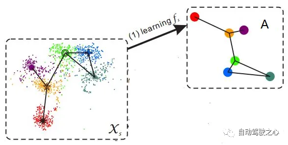

# Zero-shot Learning

## 概述

>
>
>假设小暗（纯粹因为不想用小明）和爸爸，到了动物园，看到了马，然后爸爸告诉他，这就是马；之后又看到了老虎，告诉他这种身上有条纹的动物就是老虎；最后又带他去看了熊猫，对他说：“你看这熊猫是黑白色的。”
>
>然后，爸爸给小暗安排了一个任务，让他在动物园里找一种他从没见过的动物，叫斑马，并告诉了小暗有关于斑马的信息：“斑马有着马的轮廓，身上有像老虎一样的条纹，而且它像熊猫一样是黑白色的。”最后，小暗根据爸爸的提示，在动物园里找到了斑马。

上述例子中包含了一个人类的推理过程，就是利用过去的知识（马，老虎，熊猫和斑马的描述），在脑海中推理出新对象的具体形态，从而能对新对象进行辨认。ZSL 就是希望能够模仿人类的这个推理过程，使得计算机具有识别新事物的能力。

总的来说：**ZSL就是希望我们的模型能够对其从没见过的类别进行分类，让机器具有推理能力，实现真正的智能。**

## 类别的描述

1. 类别的描述怎么来的？

   - 人工专家定义。
   - 海量数据自动学习，但效果不及人工。

2. 需要对类型赋予具体的描述，这个过程更加麻烦？

   是的，但符合人类学习规律，将事物分割为基本的语义定义，并且使用基本语义定义来辅助学习新事物。

3. 类别的描述应该如何规范？

   除了自动学习的情况外，可以利用百科中的各种定义词条，并且基于这些生成进一步的定义。

4. 怎样利用类别描述进行 Zero-shot Learning ？

   训练集类别和测试集类别之间没有交集；期间需要借助类别的描述，来建立训练集和测试集之间的联系，从而使得模型有效

## 相关数据集

- **Animal with Attributes（AwA）**
- **Caltech-UCSD-Birds-200-2011（CUB）**
- **Sun database（SUN）**
- **Attribute Pascal and Yahoo dataset（aPY）**
- **ILSVRC2012/ILSVRC2010（ImNet-2）**

## 存在问题

1. **领域漂移问题（domain shift problem）**

   在同一种属性中视觉表征相差很大，导致很难将视觉表征和语义表征正确匹配。

   

2. **枢纽点问题（Hubness problem）**

3. **语义间隔（semantic gap）**

   样本的特征往往是视觉特征，比如用深度网络提取到的特征，而语义表示却是非视觉的，这直接反应到数据上其实就是：样本在特征空间中所构成的流型与语义空间中类别构成的流型是不一致的，这使得直接学习两者之间的映射变得困难。

   

	由于样本的特征维度往往比语义的维度大，所以建立从样本 $X$ 到语义 $S$ 的映射往往会丢失信息，为了保留更多的信息，保持更多的丰富性，最流行的做法是将映射到语义空间中的样本，再重建回去，这样学习到的映射就能够得到保留更多的信息。  其中 $X_{tr}, A_{tr}$ 分别为测试集的样本数据和语义标签， $W$ 为映射矩阵。这种做法相当于岭回归的基础上加上了由语义重建样本时的偏差作为损失函数的一部分，限制了领域漂移问题。
       
$$
Loss=min||X_{tr}-W^TA_{tr}||^2+\lambda ||WX_{tr}-A_{tr}||^2
$$

## 解决方法

**self-autoencoder (SAE) 解决领域漂移问题**

由于样本的特征维度往往比语义的维度大，所以建立从样本 $X$ 到语义 $S$ 的映射往往会丢失信息，为了保留更多的信息，保持更多的丰富性，最流行的做法是将映射到语义空间中的样本，再重建回去，这样学习到的映射就能够得到保留更多的信息。如果模型建立的方式为岭回归，那么可以建立从语义空间到特征空间的映射，从而不加深hubness problem对结果的影响，也就是说将目标函数改为：
$$
Loss=min||X_{tr}-W^TA_{tr}||^2+\lambda ||WX_{tr}-A_{tr}||^2
$$

其中 $X_{tr}, A_{tr}$ 分别为测试集的样本数据和语义标签， $W$ 为映射矩阵。这种做法相当于岭回归的基础上加上了由语义重建样本时的偏差作为损失函数的一部分，限制了领域漂移问题。

**枢纽点问题**

目前对于枢纽点问题的解决主要有两种方法：如果模型建立的方式为岭回归，那么可以建立从语义空间到特征空间的映射，从而不加深hubness problem对结果的影响，也就是说将目标函数改为：

$$
Loss = min||X_{tr}-A_{tr}W||^2+\eta\Omega(W)
$$

在 AwA 数据集上，这种简单的改变能够得到76.5%的正确率，比原本提高了17.4%。其次可以使用生成模型，比如自编码器、GAN等，生成测试集的样本，这样就变成了一个传统的监督分类问题，不存在K-NN的操作，所以不存在hubness problem的影响。

**语义间隔问题**

本质是二者的流形结构不一致，因此，解决此问题的着手点就在于将两者的流形调整到一致，再学习两者之间的映射。最简单的方法自然是将类别的语义表示调整到样本的流型上，即用类别语义表示的 K 近邻样本点，重新表示类别语义即可。

## 参考文献

[零次学习（Zero-Shot Learning）入门 - 知乎 (zhihu.com)](https://zhuanlan.zhihu.com/p/34656727)

[“维度灾难”之Hubness现象浅析 - 科学空间|Scientific Spaces (kexue.fm)](https://kexue.fm/archives/9147)

[机器学习中的维数灾难_大愚若智_的博客-CSDN博客](https://blog.csdn.net/zbc1090549839/article/details/38929215)

