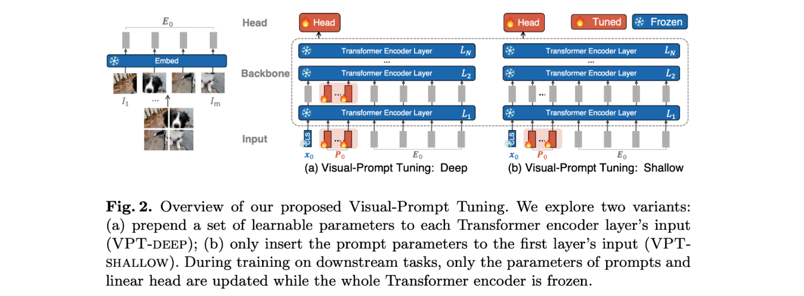
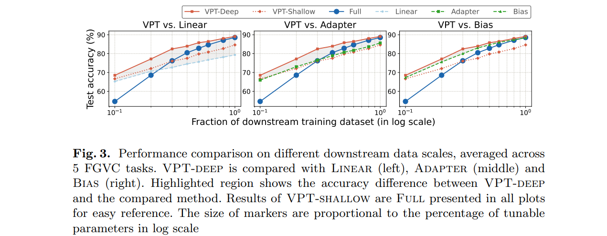
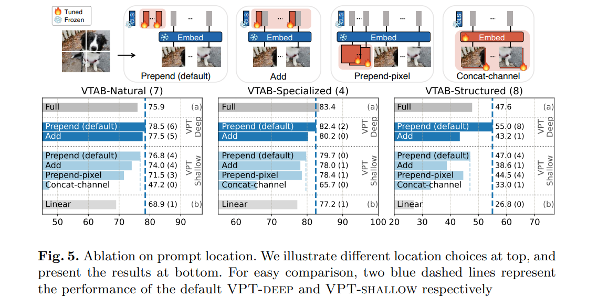

# Visual Prompt Tuning (VPT)

## 简介

与 CLIP , CoOp, CoCoOp 等需要图像-文本对应的训练方法不同， VPT 采用纯视觉 Prompt ，将 Prompt-Tuning 思想巧妙地融入了视觉任务，在大模型多任务模型的针对性训练上得到非常好的效果，颇具启发性。

## 方法

VPT 对于 Prompt 设计了两种模式：Deep 和 Shallow。Deep 模式在图像 patch 输入到 Transformer Encoder 前，拼接多个向量，包括 `CLS` 和 $P_0$ 个可学习参数，此后的每一层都是如此，注意此时 Transformer Encoder 是参数冻结的。Shallow 模式与 Deep 模式相似，但只有输入 Transformer Encoder 第一层前设置 `CLS` 和可学习参数。

## 效果

- Linear 
- Adapter
- Bias
- Full (Fine-Tuning)

这几种都是常用的 Fine-Tuning 改进方法，例如使用线性层和 Adapter 模块在冻结参数模型前实现针对任务的热插拔，总体效果来看 VPT 高于这几种热插拔方法，并且在大幅加快训练速度的同时与全面微调的最终效果相近。

VPT 默认的 Prompt 模式与 NLP 中相似，都是在正式输入数据之前插入一些东西。本文还研究了针对视觉 Prompt 的不同形式和结果，包括

- Prepend (default)
- Add
- Prepend-pixel
- Concat-channel

最终还是 Prepend 的操作比其他操作要好。

*备注：[Visual Task Adaptation Benchmark](https://google-research.github.io/task_adaptation/) 将良好的通用视觉表示定义为在对有限的特定任务数据进行训练时，在*未见过的任务上产生良好性能的表示。*VTAB 对表示的使用方式没有限制，例如，冻结特征提取、微调和其他形式的评估任务转移是允许的。类似地，表示可以在任何数据上进行预训练，VTAB 允许有监督、无监督或其他预训练策略。有一个限制：评估数据集不得在预训练期间使用。此约束旨在减轻对评估任务的过度拟合。该基准测试包含 19 个任务，这些任务来自不同的领域，具有不同的语义。所有任务都被定义为分类问题，以便为预训练模型提供一致的 API。算法不应包含任何与任务相关的逻辑，例如，所有任务都应使用相同的超参数扫描。VTAB 还可用于评估表示学习以外的技术，这些技术可提高各种任务的性能：例如架构、预处理功能或优化器。*

## 参考文献

[Visual Prompt Tuning (VPT)_Wanderer X的博客-CSDN博客](https://blog.csdn.net/wandererXX/article/details/127882053)

[2203.12119.pdf (arxiv.org)](https://arxiv.org/pdf/2203.12119.pdf)

[《Visual Prompt Tuning》视觉prompt - 知乎 (zhihu.com)](https://zhuanlan.zhihu.com/p/492910393)

[Visual Prompt Tuning_BBBBBAAAAAi的博客-CSDN博客](https://blog.csdn.net/qq_43775680/article/details/127182304)

