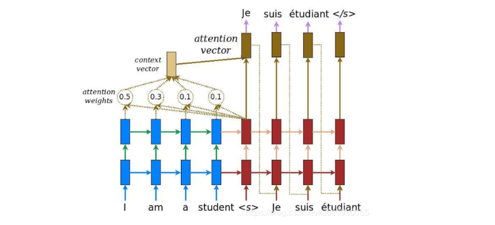
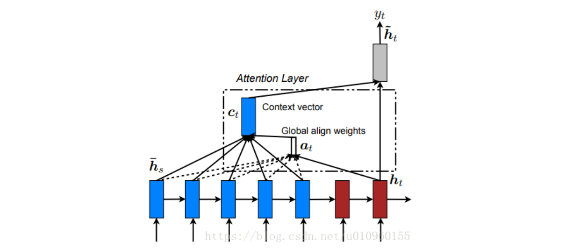

# BahdanauAttention and LuongAttention

## 理念

在原有的 Encoder-Decoder 中加入了 $attention~weights$  , $context~vector$ 和 $attention~vector$ 。这样在 Decoder 每次解码 $h_t$ 时都会考虑以前编码时的每个输出隐层状态 $\hat{h}_s$ ，并且计算出对每个 $\hat{h}_s$ 的注意力得到 $attention~weights$ ，它与 $\hat{h}_s$ 的加权和即为 $context~vector$ ，最后通过与 $h_{t-1}$ 拼接、映射和激活得 $attention~vector$ ，公式描述如下：
$$
\begin{align}
\alpha_{ts} &= \dfrac{\text{exp(score(} h_t,\hat{h}_s \text{))}}{\sum^S_{s'=1}\text{exp(score(} h_t, \hat h_{s'} \text{))}}\quad &\text{[Attention weights]}\\

c_t &= \sum_s \alpha_{ts} \hat h_s\quad &\text{[Context vector]}\\

a_t &= f(c_t, h_t) = \text{tanh}(W_c\cdot[c_t;h_t])\quad &\text{[Attention vector]}

\end{align}
$$
解释一下，这里 $h$ 指没经注意力变换的隐层状态（对应上图红、蓝色）， $\hat h$ 指经过注意力变换后的隐层状态（对应上图棕色）。

## Bahdanau Attention

文章：[NEURAL MACHINE TRANSLATION BY JOINTLY LEARNING TO ALIGN AND TRANSLATE](https://arxiv.org/pdf/1409.0473.pdf)

在这里相当于采用了 $h_{t-1}$ 和 $h_{s}$ 来计算 $h_t$ 和 $h_s$ 的 $\text{score}$ ，含义是用编码器 $s$ 位置的隐层状态和解码器 $t-1$ 位置的隐层状态来表示 $t$ 位置对 $s$ 位置的关注程度。

## Luong Attention

文章： [Effective Approaches to Attention-based Neural Machine Translation](https://arxiv.org/pdf/1508.04025.pdf) 

Luong Attention 可以看作 Bahdanau Attention 的一个兄弟，主要区别在于：

1. Bahdanau Attention 对 Encoder 和 Decoder 的双向的 RNN 的隐层状态拼接起来作为输出， Luong Attention 仅使用最上层的RNN输出。

2. 采用了 $h_t$ 来参与注意力而非 $\hat{h}_{t-1}$ 。

3. Bahdanau Attention 仅对 $\text{score}$ 采用 concat 的操作计算， Luong Attention 补充了另外两种对齐函数：
   $$
   \text{score}(h_t,\hat h_s)=
   \begin{cases}
   h^\mathsf{T}\hat h_s\\
   h^\mathsf{T} W  \hat{h}_s\\
   v^\mathsf{T} \text{tanh}(W\cdot[h_t;\hat h_s])
   
   
   \end{cases}
   $$

## 总结

两种注意力机制大体相似，主要是在计算 $\hat h_t$ 时用的是 $s_{i-1}$ 还是 $s_i$ ，在性能上差别也不是很大。 

