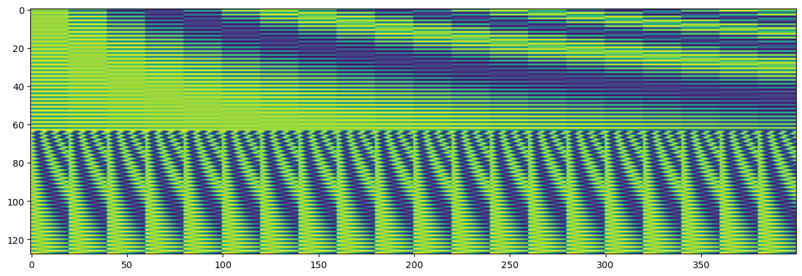

# Position Encoding

位置编码，出现在各大 **Transformer** 的预处理。首先提一下 `encoding` （编码）和 `embedding` （嵌入）的区别：一般认为 `encoding` 是一个过程，出来的结果是 `embedding` ，在本文指的是同一件事。

## 历史

**直接使用数值位置编码**
$$
PE(pos)=pos\quad ,pos\in0, 1, 2, 3 ...... T-1
$$

直接使用位置数值编码最直观，但是缺点是无上限，会造成特征倾斜，比如说模型对长句子与短句子的识别能力有很大差距。

**使用归一化的数值位置编码**

$$
PE(pos)=\dfrac{pos}{T-1}\quad,pos\in0,1,2 ......T-1
$$

这种情况虽然改进了数值的上限问题，将 $PE$ 的值域限制在 $[0, 1]$ ，但是对于长句子和短句子中词的相对位置缺乏表现能力，例如： `A` 有 100 个词， `B` 有 10 个词，在同样考虑位置编码相差 0.2 的情况下， `A` 的跨度是 $100 \times 0.2=20$ 个词，而 `B` 的跨度是 $10 \times0.2=2$ 个词。这在编码不等长度语句时，往往不能正确表示词与词之间的相对位置。

**使用周期性函数作位置编码**

$$
PE(pos)=sin/cos(\dfrac{pos}{\alpha})\quad,pos\in0,1,2 ...... T-1
$$

使用正弦、余弦函数可以同时解决值域限制和相对位置表示的问题：显然 $PE$ 的值域限制在 $[-1,1]$ ，且任何长度的语句，他在临近词的相对位置表示上都是相似的（因为是周期函数）。这种方法其实已经能用了，但是还不够好，因为周期是由参数 $\alpha$ 决定的，周期太长那么相邻位置的差异不够明显，周期太短又会很容易出现位置编码一样的情况。

**使用多个周期性函数作位置编码**

我们知道 NLP 里面词是以向量形式运算的，即会有一个词嵌入维度 $d_{model}$ ，那我们也使用多个周期函数把 $PE$ 的维度也升到 $d_{model}$ 维，不仅可以解决单个周期函数表示能力不足的问题，在实际与词向量运算时也可以直接相加操作。实际上，`Transformer` 使用的就是这样的方法，将不同的 $sin/cos$ 函数和不同的 $\alpha$ 结合，生成 $PE$ 矩阵。

## 正余弦编码

NLP 使用的位置编码：

$$
\begin{cases}
PE(pos,2i)&=sin(\dfrac{pos}{10000^{2i/d_{model}}})\\
PE(pos,2i+1)&=cos(\dfrac{pos}{10000^{2i/d_{model}}})\\
\end{cases}
$$

参数 $pos$ 表示词位置，参数 $i$ 表示在 $d_{model}$ 中的第几位。

CV 使用的位置编码与 NLP 的正余弦编码相似，但是在 CV 领域的数据是二维的，因此编码也需要是二维的。分别对图片 $X$ 和 $Y$ 方向做正余弦编码，然后扩展到二维，最后再 `concat` 起来，问题是这样最后会得到 2 倍 $d_{model}$ 维度的编码。如果依然想让每个位置编码的特征维度为 $d_{model}$ ，则应该让 $X$ 和 $Y$ 方向各占一半 $\dfrac{d_{model}}{2}$ ，例如在 `DETR` 中的提供了正余弦位置编码 `PositionEmbeddingSine`：

```python
class PositionEmbeddingSine(nn.Module):
    """
    This is a more standard version of the position embedding, very similar to the one
    used by the Attention is all you need paper, generalized to work on images.
    """
    def __init__(self, num_pos_feats=64, temperature=10000, normalize=False, scale=None):
        # num_pos_feats 即单个维度的位置编码维度，因为最后 X 和 Y 方向的 PE 要 concat ，因此这个数应该取 d_model/2
        # temperature 即公式里分母那个 10000 ，值越大正余弦周期越长，玄学
        super().__init__()
        self.num_pos_feats = num_pos_feats
        self.temperature = temperature
        self.normalize = normalize
        if scale is not None and normalize is False:
            raise ValueError("normalize should be True if scale is passed")
        if scale is None:
            scale = 2 * math.pi
        self.scale = scale

    def forward(self, tensor_list: NestedTensor):
        # NestedTensor是DETR代码中用的一个数据结构，包括tensor和mask两个成员。
        # tensors就是输入的图像、mask跟图像对应，除padding位置为true外，其他位置都为false。
        x = tensor_list.tensors
        mask = tensor_list.mask
        assert mask is not None
        not_mask = ~mask
        # x: (B, H, W), mask: (B, H, W)
        
        # 生成 X Y 位置网格
        y_embed = not_mask.cumsum(1, dtype=torch.float32)
        x_embed = not_mask.cumsum(2, dtype=torch.float32)
        if self.normalize:
            eps = 1e-6
            y_embed = y_embed / (y_embed[:, -1:, :] + eps) * self.scale
            x_embed = x_embed / (x_embed[:, :, -1:] + eps) * self.scale
        # x_embed, y_embed: (B, H, W)
		
        # 生成公式里面 sin/cos 括号里面分母那一块
        dim_t = torch.arange(self.num_pos_feats, dtype=torch.float32, device=x.device)
        dim_t = self.temperature ** (2 * (dim_t // 2) / self.num_pos_feats)
        # dim_t: (num_pos_feats, )
		
        # 生成公式里面 sin/cos 括号里面那一块
        pos_x = x_embed[:, :, :, None] / dim_t
        pos_y = y_embed[:, :, :, None] / dim_t
        # pos_x, pos_y: (B, H, W, num_pos_feats)
        
        # 生成 X 和 Y 方向的 PE
        pos_x = torch.stack((pos_x[:, :, :, 0::2].sin(), pos_x[:, :, :, 1::2].cos()), dim=4).flatten(3)
        pos_y = torch.stack((pos_y[:, :, :, 0::2].sin(), pos_y[:, :, :, 1::2].cos()), dim=4).flatten(3)
        # pos_x, pos_y: (B, H, W, num_pos_feats)
        
        # 将 X 和 Y 方向的 PE 拼接，使 num_pos_feats 的位置变成 2 倍，然后交换通道，将 num_pos_feats 放前面，高宽放后面
        pos = torch.cat((pos_y, pos_x), dim=3).permute(0, 3, 1, 2)
        # pos: (B, 2*num_pos_feats, H, W)，注意这个 2*num_pos_feats 就是对应 d_model
        return pos
```

以下是令 `num_pos_feats=64` `temperature=10` 的 `PositionEmbeddingSine` 对一个 $20\times20$ 矩阵编码后的结果（生成的结果应该是 $128\times20\times20$ 的，为了方便展示，将高和宽拉直为 $400$ 了，因此是一个 $128\times400$ 的图，横轴表示位置，纵轴表示编码维度）：

```python
pe = PositionEmbeddingSine(num_pos_feats=64, temperature=10)
nested_tensor = [torch.randn(2*20*20*3).view(2, 3, 20, 20), torch.zeros(2*20*20).view(2, 20, 20).bool()]
res = pe(nested_tensor)[0].view(128,400).numpy()
import matplotlib.pyplot as plt
plt.imshow(res)
```



## 可学习编码

另一方面采用可学习的位置编码也是不错的选择，具体是通过 `torch.nn.Embedding` 层来实现，它会生成一个具有 `num_embeddings` 行、 `embedding_dim` 列的矩阵，对应位置编码的 `pos` 和 `d_model` 。在 `DETR` 中也提供了这一种位置编码的实现：

```python
class PositionEmbeddingLearned(nn.Module):
    """
    Absolute pos embedding, learned.
    """
    def __init__(self, num_pos_feats=256):
        super().__init__()
        self.row_embed = nn.Embedding(50, num_pos_feats)
        self.col_embed = nn.Embedding(50, num_pos_feats)
        self.reset_parameters()

    def forward(self, tensor_list: NestedTensor):
        # 这种方法与前面相似，就是用可学习的 nn.Embedding 层代替了公式，也是分别计算 X 和 Y 的 PE
        # 后再 concat 起来
        x = tensor_list.tensors
        h, w = x.shape[-2:]
        i = torch.arange(w, device=x.device)
        j = torch.arange(h, device=x.device)
        x_emb = self.col_embed(i)
        y_emb = self.row_embed(j)
        pos = torch.cat([
            x_emb.unsqueeze(0).repeat(h, 1, 1),
            y_emb.unsqueeze(1).repeat(1, w, 1),
        ], dim=-1).permute(2, 0, 1).unsqueeze(0).repeat(x.shape[0], 1, 1, 1)
        # pos: (B, 2*num_pos_feats, H, W)，注意这个 2*num_pos_feats 就是对应 d_model
        return pos
```

## 为什么可以直接相加到 Word Embedding

 假设词向量 $x^i \in R^{d_{model}\times 1}$ ，映射矩阵 $W\in R^{d_{model}\times d_{model}}$ ，于是在没有位置编码时映射结果为：
 
$$
W \cdot x^i \in R^{d_{model}\times1}
$$

假设现在在 $x^i$ concat 一个 $n$ 维位置向量 $x^p \in R^{n\times1}$ ，可以表示为 $x^i \leftarrow [(x^i)^T,(x^p)^T]^T \in R^{(d_{model}+n) \times 1}$ ，同样变换矩阵应变为 $W\leftarrow [W_i, W_p] \in R^{d_{model}\times(d_{model}+n)}$ ，此时映射结果为：

$$
W \cdot x^i= [W_i, W_p] \cdot [(x^i)^T,(x^p)^T]^T  = W_i \cdot x^i + W_p \cdot x^p=embed^i + pos^i
$$

可以看到：将词和位置映射后相加，跟将词与位置 concat 后再映射，再本质上是一样的， **虽然维度没有增加但位置信息已经融入到了向量中** 。

## 参考资料

1. [青空栀浅](https://www.zhihu.com/people/yangning9371), "[Transformer中的position encoding](https://zhuanlan.zhihu.com/p/166244505)"
2. [zuoyou-HPU](https://blog.csdn.net/weixin_42715977), "[Transformer中的position encoding(位置编码一)](https://blog.csdn.net/weixin_42715977/article/details/122135262)"
3. [top_小酱油](https://www.jianshu.com/u/4933977bccec), "[通俗讲解pytorch中nn.Embedding原理及使用](https://www.jianshu.com/p/63e7acc5e890)"
4. [facebookresearch](https://github.com/facebookresearch), "[DETR 位置编码源码](https://github.com/facebookresearch/detr/blob/main/models/position_encoding.py)"
5. CW不要無聊的風格， "[Transformer 修炼之道（一）、Input Embedding](https://zhuanlan.zhihu.com/p/372279569)"


