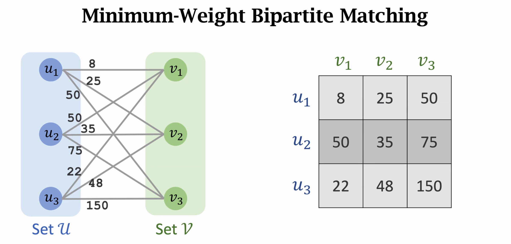
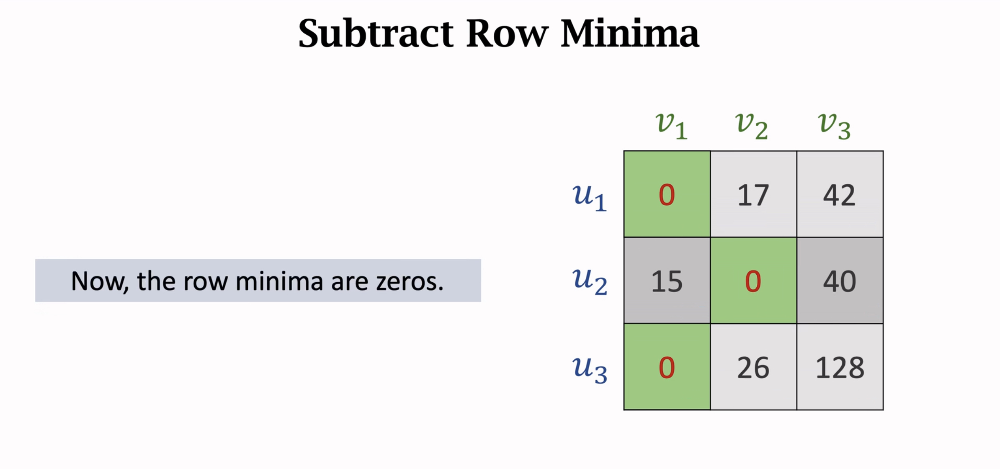
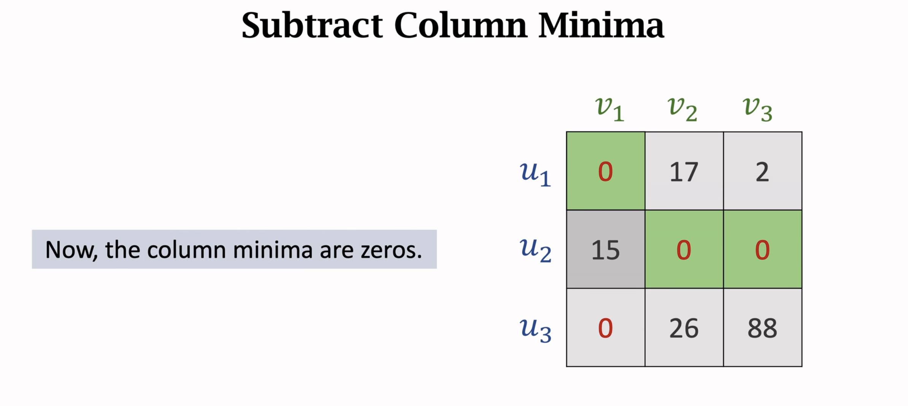
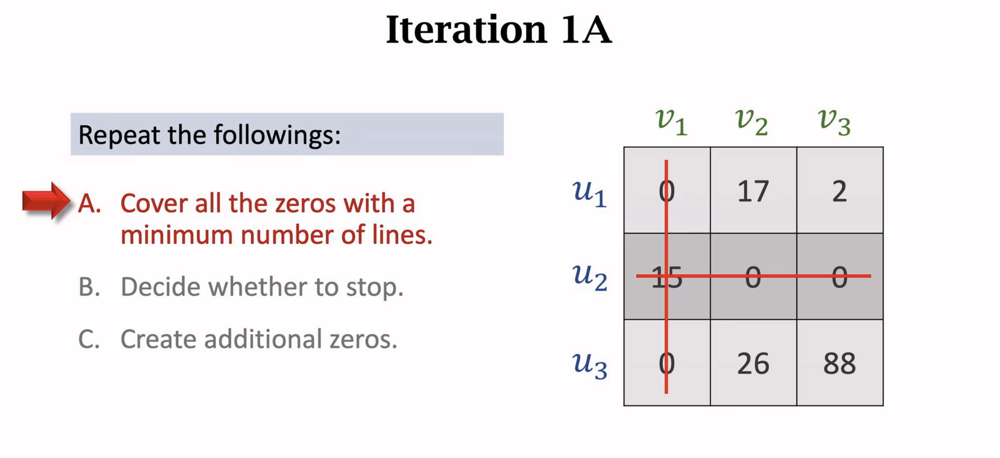
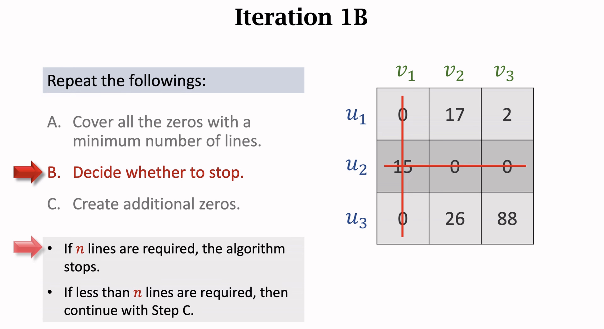
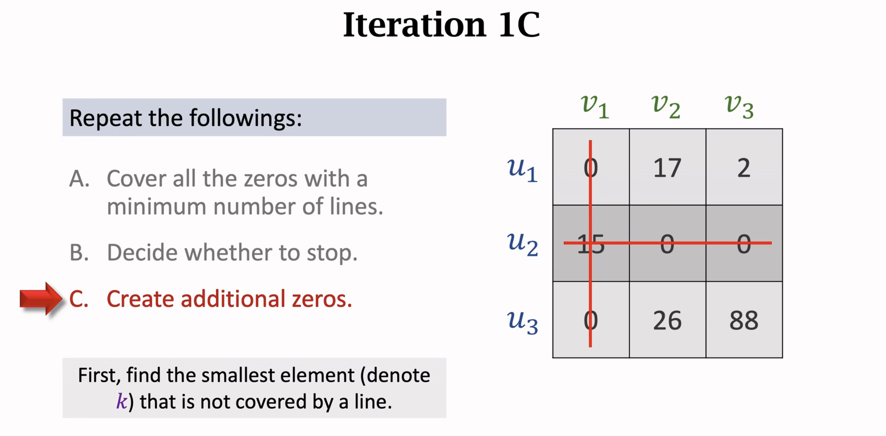
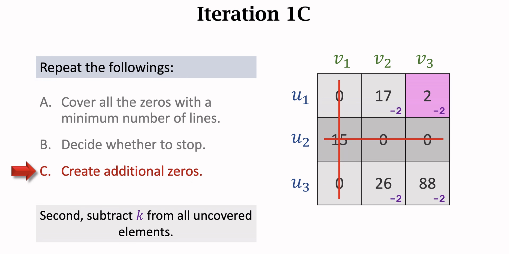
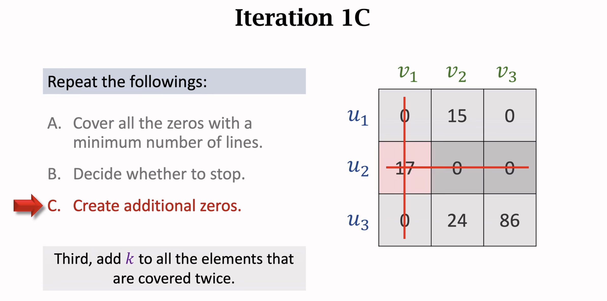
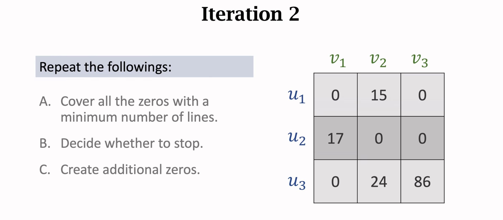
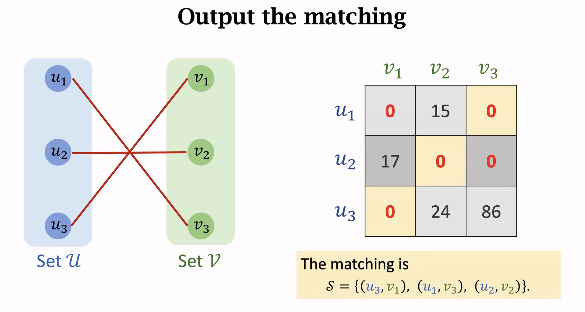

# Bipartite Matching & Hungarian Algorithm

二分图匹配与匈牙利算法，出现在 **DETR** 的目标检测匹配上。

## **概念描述**

**二分图(Bipartite)** 二分图又称作二部图，是图论中的一种特殊模型。设$G=(V,E)$是一个无向图。如顶点集$V$可分割为两个互不相交的子集，并且图中每条边依附的两个顶点都分属两个不同的子集。则称图$G$为二分图。我们将上边顶点集合称为$V_X$集合，下边顶点结合称为$V_Y$集合，如下图就是一个二分图：


**匹配(Matching)** 给定一个二分图$G$，在$G$的一个子图$M$中，$M$的边集${E}$中的任意两条边都不依附于同一个顶点，则称$M$是一个匹配。如下，在子图中两条边都不依附同一个顶点，因此它是$G$的一个匹配：


**极大匹配(Maximal Matching)** 是指在当前已完成的匹配下,无法再通过增加未完成匹配的边的方式来增加匹配的边数。如下，在子图中已经不能再添加任何一条边来扩大匹配了（$x_3$ 和 $x_4$ 在 $G$ 中并无边相连），因此它是一个极大匹配：


**最大匹配(Maximum Matching)** 是所有极大匹配当中边数最大的一个匹配。选择这样的边数最大的子集称为图的最大匹配问题。如下，通过改变一批匹配的边可以让 $V_X$ 和 $V_Y$ 所有的点都连接上，因此这是一个最大匹配：


**最小带权二分图匹配(Minimum-Weight Bipartite matching)** 给定一组对应的 $V_X$ 和 $V_Y$ 及两两之间的 $cost$ 要求通过算法，找到 $cost$ 最小那组匹配。一般是输入一个带权矩阵，输出边集。



## 匈牙利算法

匈牙利算法是解决上面**最小带权二分图匹配(Minimum-Weight Bipartite matching)**的最重要算法，在原理上可以通过增广边来实现，请参考：

https://www.cnblogs.com/shenben/p/5573788.html

在计算上可以参考：

[14-4: 匈牙利算法 Hungarian Algorithm]( https://www.bilibili.com/video/BV16K4y1X7Ph?share_source=copy_web&vd_source=8f6b0c8c42ee567252d4934bac66d3f6)

在邻接矩阵中，把每一行减去行最小值，再每一列减去列最小值。





用最少的横线或竖线把所有的`0`都覆盖：



判断是否应该结束，令 `n = n_rows (or n_columns)`，假如横竖线数量不少于 `n`，即停止，否则继续迭代矩阵：



在没有被横竖线覆盖的元素中，找到最小值 `k` 将所有未覆盖元素减去 `k`，所有线交叉处加上 `k` ：







得到新的矩阵，继续回到 A 操作，寻找最少能够覆盖所有 `0` 的横竖线······直到在某一次迭代中在 B 操作满足要求退出迭代，得到矩阵：



在最后的矩阵中，我们关注 $u_i$ 中 `0` 的位置，为各个 $u_i$ 分配对应的 $v_j$ 结点：



## 代码

在 `scipy` 库中有集成实现，直接对 `cost` 矩阵调用 `linear_sum_assignment` 方法，返回顶点行、列序号。

```python
import numpy as np
from scipy.optimize import linear_sum_assignment

cost = np.array([[8, 25, 50], 
                 [50, 35, 75], 
                 [22, 48, 150]])
row_ind, col_ind = linear_sum_assignment(cost)
row_ind, col_ind
```

```
>> (array([0, 1, 2], dtype=int64), array([2, 1, 0], dtype=int64))
```

## 其他

**源码：**

```python
# Hungarian algorithm (Kuhn-Munkres) for solving the linear sum assignment
# problem. Taken from scikit-learn. Based on original code by Brian Clapper,
# adapted to NumPy by Gael Varoquaux.
# Further improvements by Ben Root, Vlad Niculae and Lars Buitinck.
#
# Copyright (c) 2008 Brian M. Clapper <bmc@clapper.org>, Gael Varoquaux
# Author: Brian M. Clapper, Gael Varoquaux
# License: 3-clause BSD

import numpy as np


def linear_sum_assignment(cost_matrix):
    """Solve the linear sum assignment problem.
    The linear sum assignment problem is also known as minimum weight matching
    in bipartite graphs. A problem instance is described by a matrix C, where
    each C[i,j] is the cost of matching vertex i of the first partite set
    (a "worker") and vertex j of the second set (a "job"). The goal is to find
    a complete assignment of workers to jobs of minimal cost.
    Formally, let X be a boolean matrix where :math:`X[i,j] = 1` iff row i is
    assigned to column j. Then the optimal assignment has cost
    .. math::
        \min \sum_i \sum_j C_{i,j} X_{i,j}
    s.t. each row is assignment to at most one column, and each column to at
    most one row.
    This function can also solve a generalization of the classic assignment
    problem where the cost matrix is rectangular. If it has more rows than
    columns, then not every row needs to be assigned to a column, and vice
    versa.
    The method used is the Hungarian algorithm, also known as the Munkres or
    Kuhn-Munkres algorithm.
    Parameters
    ----------
    cost_matrix : array
        The cost matrix of the bipartite graph.
    Returns
    -------
    row_ind, col_ind : array
        An array of row indices and one of corresponding column indices giving
        the optimal assignment. The cost of the assignment can be computed
        as ``cost_matrix[row_ind, col_ind].sum()``. The row indices will be
        sorted; in the case of a square cost matrix they will be equal to
        ``numpy.arange(cost_matrix.shape[0])``.
    Notes
    -----
    .. versionadded:: 0.17.0
    Examples
    --------
    >>> cost = np.array([[4, 1, 3], [2, 0, 5], [3, 2, 2]])
    >>> from scipy.optimize import linear_sum_assignment
    >>> row_ind, col_ind = linear_sum_assignment(cost)
    >>> col_ind
    array([1, 0, 2])
    >>> cost[row_ind, col_ind].sum()
    5
    References
    ----------
    1. http://csclab.murraystate.edu/bob.pilgrim/445/munkres.html
    2. Harold W. Kuhn. The Hungarian Method for the assignment problem.
       *Naval Research Logistics Quarterly*, 2:83-97, 1955.
    3. Harold W. Kuhn. Variants of the Hungarian method for assignment
       problems. *Naval Research Logistics Quarterly*, 3: 253-258, 1956.
    4. Munkres, J. Algorithms for the Assignment and Transportation Problems.
       *J. SIAM*, 5(1):32-38, March, 1957.
    5. https://en.wikipedia.org/wiki/Hungarian_algorithm
    """
    cost_matrix = np.asarray(cost_matrix)
    if len(cost_matrix.shape) != 2:
        raise ValueError("expected a matrix (2-d array), got a %r array"
                         % (cost_matrix.shape,))

    # The algorithm expects more columns than rows in the cost matrix.
    '''代价矩阵需要列数 ≥ 行数'''
    if cost_matrix.shape[1] < cost_matrix.shape[0]:
        cost_matrix = cost_matrix.T
        transposed = True
    else:
        transposed = False

    state = _Hungary(cost_matrix)

    # No need to bother with assignments if one of the dimensions
    # of the cost matrix is zero-length.
    step = None if 0 in cost_matrix.shape else _step1

    while step is not None:
        step = step(state)

    if transposed:
        marked = state.marked.T
    else:
        marked = state.marked
    return np.where(marked == 1)


class _Hungary(object):
    """State of the Hungarian algorithm.
    Parameters
    ----------
    cost_matrix : 2D matrix
        The cost matrix. Must have shape[1] >= shape[0].
    """

    def __init__(self, cost_matrix):
        self.C = cost_matrix.copy()

        n, m = self.C.shape
        self.row_uncovered = np.ones(n, dtype=bool)
        self.col_uncovered = np.ones(m, dtype=bool)
        self.Z0_r = 0
        self.Z0_c = 0
        self.path = np.zeros((n + m, 2), dtype=int)
        self.marked = np.zeros((n, m), dtype=int)

    def _clear_covers(self):
        """Clear all covered matrix cells"""
        self.row_uncovered[:] = True
        self.col_uncovered[:] = True


# Individual steps of the algorithm follow, as a state machine: they return
# the next step to be taken (function to be called), if any.

def _step1(state):
    """Steps 1 and 2 in the Wikipedia page."""

    """
    Step 1: For each row of the matrix, find the smallest element and
    subtract it from every element in its row.    
    减去每一行的最小值
    """
    state.C -= state.C.min(axis=1)[:, np.newaxis]
    
    """
    Step 2: Find a zero (Z) in the resulting matrix. If there is no
    starred zero in its row or column, star Z. Repeat for each element
    in the matrix.    
    如果一行或列中没有星标的0，则标记0*
    """
    for i, j in zip(*np.where(state.C == 0)):
        if state.col_uncovered[j] and state.row_uncovered[i]:
            state.marked[i, j] = 1
            state.col_uncovered[j] = False
            state.row_uncovered[i] = False

    state._clear_covers()
    return _step3


def _step3(state):
    """
    Step3：Cover each column containing a starred zero. If n columns are covered,
    the starred zeros describe a complete set of unique assignments.
    In this case, Go to DONE, otherwise, Go to Step 4.
    
    覆盖每列包含加星号的零。如果覆盖了n列，加星号的零表示完整的唯一结果集。
    """
    marked = (state.marked == 1)
    state.col_uncovered[np.any(marked, axis=0)] = False

    if marked.sum() < state.C.shape[0]:
        return _step4


def _step4(state):
    """
    Step4：Find a noncovered zero and prime it. If there is no starred zero
    in the row containing this primed zero, Go to Step 5. Otherwise,
    cover this row and uncover the column containing the starred
    zero. Continue in this manner until there are no uncovered zeros
    left. Save the smallest uncovered value and Go to Step 6.
    
    找到一个未覆盖的零并将其准备好。 如果准备好的零所在行中没有加星号的零，
    请转到步骤5。否则，覆盖该行并找出包含加注星号的零的列。 继续以这种方式
    进行操作，直到没有剩余的零为止。保存最小的发现值，然后转到步骤6。
    """
    # We convert to int as numpy operations are faster on int
    C = (state.C == 0).astype(int)
    covered_C = C * state.row_uncovered[:, np.newaxis]
    covered_C *= np.asarray(state.col_uncovered, dtype=int)
    n = state.C.shape[0]
    m = state.C.shape[1]

    while True:
        # Find an uncovered zero
        row, col = np.unravel_index(np.argmax(covered_C), (n, m))
        if covered_C[row, col] == 0:
            return _step6
        else:
            state.marked[row, col] = 2
            # Find the first starred element in the row
            star_col = np.argmax(state.marked[row] == 1)
            if state.marked[row, star_col] != 1:
                # Could not find one
                state.Z0_r = row
                state.Z0_c = col
                return _step5
            else:
                col = star_col
                state.row_uncovered[row] = False
                state.col_uncovered[col] = True
                covered_C[:, col] = C[:, col] * (
                    np.asarray(state.row_uncovered, dtype=int))
                covered_C[row] = 0


def _step5(state):
    """
    Step5：Construct a series of alternating primed and starred zeros as follows.
    Let Z0 represent the uncovered primed zero found in Step 4.
    Let Z1 denote the starred zero in the column of Z0 (if any).
    Let Z2 denote the primed zero in the row of Z1 (there will always be one).
    Continue until the series terminates at a primed zero that has no starred
    zero in its column. Unstar each starred zero of the series, star each
    primed zero of the series, erase all primes and uncover every line in the
    matrix. Return to Step 3

	构造如下一系列交替的填色和加星号的零：
     令Z0代表在步骤4中发现的未覆盖的准备好的零 0'。
     令Z1表示Z0列中的星号零 0*（如果有的话）。
     令Z2表示Z1行中的准备好的零 0'（始终为1个）。
     继续直到0'所在列没有星标0*，终止该序列。取消对每个已加星标的零的星标，对系列中的每个0'加星标，去除所有的'和覆盖线。 返回步骤3。
    """
    count = 0
    path = state.path
    path[count, 0] = state.Z0_r
    path[count, 1] = state.Z0_c

    while True:
        # Find the first starred element in the col defined by
        # the path.
        row = np.argmax(state.marked[:, path[count, 1]] == 1)
        if state.marked[row, path[count, 1]] != 1:
            # Could not find one
            break
        else:
            count += 1
            path[count, 0] = row
            path[count, 1] = path[count - 1, 1]

        # Find the first prime element in the row defined by the
        # first path step
        col = np.argmax(state.marked[path[count, 0]] == 2)
        if state.marked[row, col] != 2:
            col = -1
        count += 1
        path[count, 0] = path[count - 1, 0]
        path[count, 1] = col

    # Convert paths
    for i in range(count + 1):
        if state.marked[path[i, 0], path[i, 1]] == 1:
            state.marked[path[i, 0], path[i, 1]] = 0
        else:
            state.marked[path[i, 0], path[i, 1]] = 1

    state._clear_covers()
    # Erase all prime markings
    state.marked[state.marked == 2] = 0
    return _step3


def _step6(state):
    """
    Step 6: Add the value found in Step 4 to every element of each covered row,
    and subtract it from every element of each uncovered column.
    Return to Step 4 without altering any stars, primes, or covered lines.
	
	将在第4步中找到的值添加到每个覆盖行的每个元素中，
    并将其从每个未覆盖列的每个元素中减去。
    返回第4步，而不更改任何星号，或遮盖线。
    """
    # the smallest uncovered value in the matrix
    if np.any(state.row_uncovered) and np.any(state.col_uncovered):
        minval = np.min(state.C[state.row_uncovered], axis=0)
        minval = np.min(minval[state.col_uncovered])
        state.C[~state.row_uncovered] += minval
        state.C[:, state.col_uncovered] -= minval
    return _step4
```

